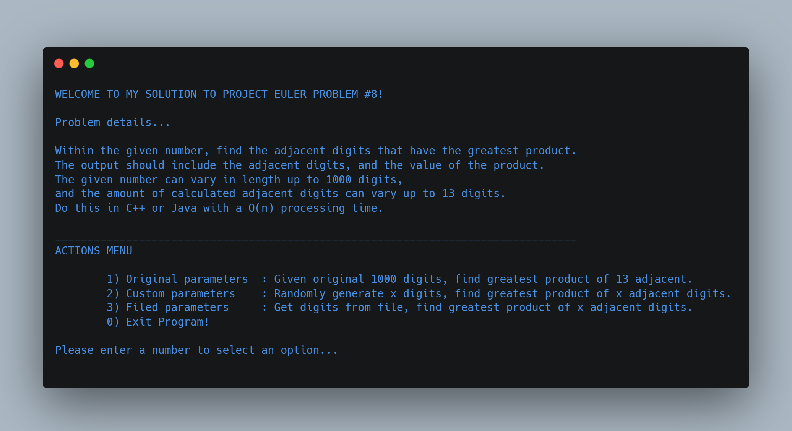
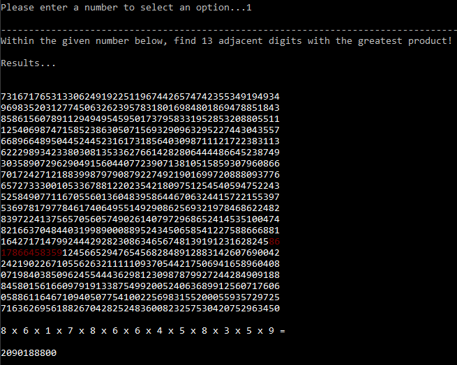
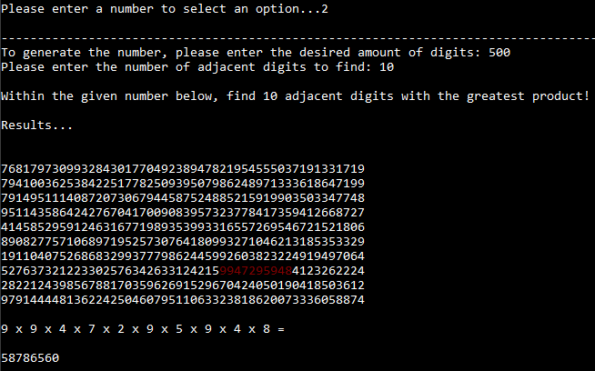
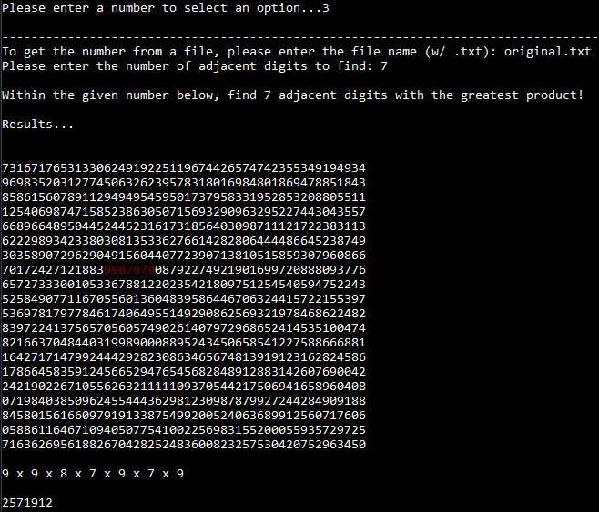

# ProjectEuler8_Largest-Product-in-a-Series

(FSC-CSC-251-ProjectEuler#8)

Original prompt:
https://projecteuler.net/problem=8

## Output Menu

## Assignment Context

This project was assigned as a C++ exercise taken from Project Euler for my Discrete Structures class.

Much like other coding educational tools such as LeetCode, Project Euler provides users with coding prompts to practice their programming skills.

Where Project Euler differs is by challenging users with mathematical and computer programming problems that require a combination of mathematical insights, computer skills, and programming knowledge to solve.

Project Eulers question #8 provides a 1000-digit number, and I was to find the thirteen adjacent digits with the greatest product, and to provide the value of this product.

Additionally, my professor had further challenged us by constraining solutions to an O(n) processing time. 

This project was written with C++ in Visual Studio 2022.

## Features

My program finds the solution to this problem in multiple ways, and prompts the user to select their desired method of drawing an answer. 

In all options listed, the program will provide the solution by highlighting the adjacent numbers in red, then show the value of their product below. 

All solutions are found within the required O(n) processing time.

1. **Original** - finds the thirteen adjacent digits solution from the given 1000 digit number. 
2. **Generate** - finds the solution to the user input number of adjacent digits from a randomly generated number consisting of a user input number of digits. 
3. **Custom** - finds the solution to the user input number of adjacent digits from digits read within a user selected file. 
4. **Exit** - Closes the application.

## How It Works

### Core Functions

The program has three main functions: `NumFromFile`, `NumGenerator`, and `FindGreatestProduct`, and uses a main function to execute these functions based on user input.

**The first function** is called `NumFromFile` 
This function takes a string parameter that specifies the name of a text file that contains a large number. 
It opens the file, reads it line by line, and concatenates all the lines into a single string. 
This string is then returned as the output of the function.

**The second function** is called `NumGenerator` 
This function takes an integer parameter that specifies the number of digits to be generated in the random number. 
It generates a random number by using the `rand` function and concatenating the individual digits of the number. 
The function then returns the random number as a string.

**The third function** is called `FindGreatestProduct` 
This function takes two parameters: a string of digits and an integer that specifies the number of adjacent digits to be considered. 
The function calculates the product of the first n digits (specified by the `numOfAdjacents` parameter), then slides a window of size `numOfAdjacents` across the entire string to find the product of the next n digits, and so on, until the end of the string is reached. 
The function keeps track of the largest product seen so far, and returns the largest product and its index (the starting position of the adjacent digits that gave rise to this product).

**The main function** uses the three functions described above to accomplish the tasks listed in **Features**. 
Specifically, it calls the `NumFromFile` function to read the original 1000-digit number from a file, or to read in a specified file, and calls the `NumGenerator` function to generate a random number. 
It then calls the `FindGreatestProduct` function to find the largest product of a specified number of adjacent digits, and outputs the resulting product and the adjacent digits that gave rise to that product, along with any relevant information that would help understand the output better.

The program also uses a few **additional functions** to break down the output in a visually pleasing way, including highlighted solutions. 
Specifically, the function called `FindMultipliers` converts the adjacent digits that give rise to the largest product into a string of multiplication expressions, separated by 'x', and the function called `NumWithSolution` formats the number and its adjacent digits and products into three different sections for better readability.

The main function is responsible for executing these three functions based on user input. It uses a while loop to allow the user to select from three options:

### Option 1: Solving the original question with given parameters 

In this option, the program reads in the 1000-digit number from a file called "original.txt" using the NumFromFile function. 
It then calls the FindGreatestProduct function with an input of 13 (the number of adjacent digits to consider), and stores the output (the largest product and its index) in variables. 
Finally, it outputs the largest product, as well as the adjacent digits that gave rise to that product, by calling the NumWithSolution function.

#### Output

### Option 2: Solving a generated question with custom parameters

In this option, the program allows the user to specify the number of digits to generate, as well as the number of adjacent digits to consider. 
It generates a random number of the specified length using the NumGenerator function, and then calls the FindGreatestProduct function with the specified number of adjacent digits. 
The program stores the resulting largest product and its index in variables, and outputs the largest product, as well as the adjacent digits that gave rise to that product, by calling the NumWithSolution function.

#### Output

### Option 3: Solving a custom question with custom parameters

In this option, the program allows the user to specify a filename for a text file containing a large number. 
It reads in the number from the specified file using the NumFromFile function, and then calls the FindGreatestProduct function with the specified number of adjacent digits. 
The program stores the resulting largest product and its index in variables, and outputs the largest product, as well as the adjacent digits that gave rise to that product, by calling the NumWithSolution function.

#### Output

